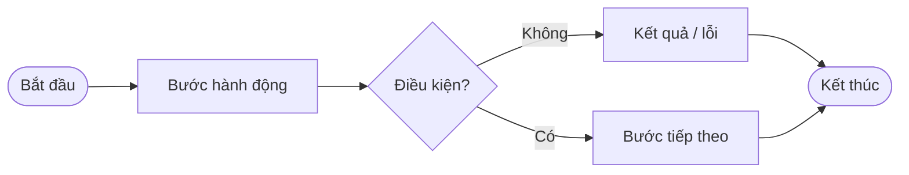

# Flowchart — Business Process Diagrams

Create or update `docs/{module-name}/flowchart.md` with Mermaid **activity-style** flowcharts for operators and stakeholders — not developers.

## Resolve scope

| Input | Action |
|-------|--------|
| `module-name` only | Document all main business flows of the module |
| `module-name` + screen hints | Document listed screens/flows + shared gates (e.g. login, admin access) |
| Tagged file | Infer module from path/name; trace MVC views, actions, API models |

**Output path**: `docs/{module-name}/flowchart.md` (kebab-case folder). Create folder if missing.

## Load context (required)

Before writing or updating flowcharts:

1. Rule: `.cursor/rules/flowchart.mdc`
2. Project rules (if present): `project.mdc`, `sources-base.mdc`
3. This skill (formatting and checklist below)

## Workflow

1. Explore code and existing docs (`docs/{module}/`, API docs, design docs).
2. List distinct **business processes** (user actions, scheduled jobs, system hooks).
3. For each process, draft one horizontal flowchart.
4. Write the markdown file; add **Tham chiếu** links to sibling docs when they exist.
5. Run the checklist below.

Delegate codebase exploration to subagent **flowchart-explorer** (`.cursor/agents/flowchart-explorer.md`) when the module is large or unfamiliar.

## Mermaid rules

| Rule | Requirement |
|------|-------------|
| Direction | Always `flowchart LR` (left → right) |
| Start / End | `([Bắt đầu])` and `([Kết thúc])` — every path must reach **Kết thúc** |
| Actions | `[Mô tả ngắn]` — verb phrase, user-facing Vietnamese |
| Decisions | `{Câu hỏi?}` — diamond; branches labeled `\|Có\|` and `\|Không\|` (or explicit choices like `\|Bảng\|`, `\|Lịch\|`) |
| Depth | High-level only — 4–10 nodes per flow; no deep validation chains |
| Technical terms | **Forbidden** in labels: table names (`TBL_*`), API names (`fnXxx`), column names, SMTP/AES/JSON field names |

### Node templates



### Label style — good vs bad

| Bad (too technical / deep) | Good (user-friendly) |
|----------------------------|----------------------|
| Nhập USER_NAME / PASSWORD | User đăng nhập |
| User tồn tại? + Mật khẩu đúng? | Thành công? |
| Ghi TBL_LOGIN_HISTORY | Ghi nhận lịch sử đăng nhập |
| Gọi fnRunDailyLoginReport | Scheduler chạy theo lịch |
| Lưu TBL_MAIL_SENDER_CONFIG | Lưu cấu hình mail |

## File structure

```markdown
# {Module Title} — Sơ đồ quy trình nghiệp vụ

{1–2 câu giới thiệu: mỗi quy trình có Bắt đầu, điều kiện, Kết thúc.}

---

## 1. {Tiêu đề ngắn}

{Mô tả 1 dòng — khi nào flow chạy.}

\`\`\`mermaid
flowchart LR
    ...
\`\`\`

---

## N. ...

## Tham chiếu

- {link tài liệu liên quan nếu có}
```

- Section titles: numbered `## 1.`, `## 2.`, … — short, scannable.
- One Mermaid block per section.
- Language: **Vietnamese** for labels and titles unless the user requests English.

## Which flows to include

Cover all **main** processes for the module, typically:

- Entry / access gate (login, session, permission) if shared
- Each primary screen (view list, view detail, filter, switch view mode)
- Create / update / delete (can be one “Quản lý danh sách” flow with `{Thao tác?}`)
- Background or scheduled jobs (report, cleanup, sync)
- Shared sub-flows (e.g. send email) only if central to the module — one generic flow is enough

Skip: unit-test paths, build/deploy, pure CRUD with no business meaning.

## Checklist (must pass)

- [ ] Every diagram uses `flowchart LR`
- [ ] Every path: **Bắt đầu** → … → **Kết thúc**
- [ ] Every branch from a diamond has a label (`|Có|`, `|Không|`, or explicit option)
- [ ] No table names, API names, or internal field names in nodes
- [ ] Steps are short and understandable by non-developers
- [ ] File saved to `docs/{module-name}/flowchart.md`

## Reference example

Gold standard in this bundle: [`docs/login-monitor/flowchart.md`](../../../docs/login-monitor/flowchart.md). Copy structure and label style for other modules.

## Related

- **Command**: `.cursor/commands/flowchart.md`
- **Rule**: `.cursor/rules/flowchart.mdc`
- **Subagent**: `.cursor/agents/flowchart-explorer.md`
