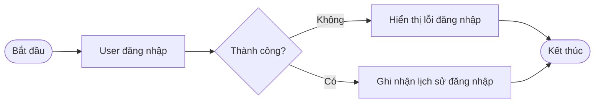
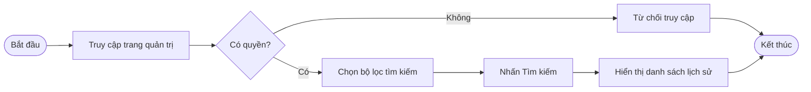
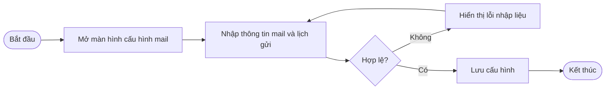
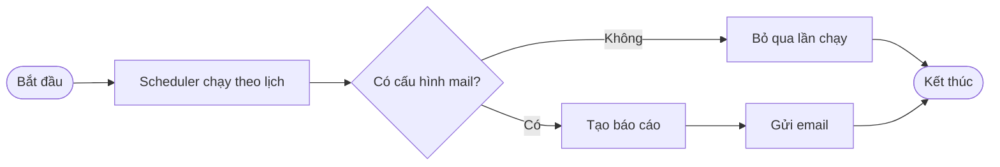

# Login Monitor — Sơ đồ quy trình nghiệp vụ

Tài liệu mẫu (gold standard) cho workflow `/flowchart`. Mỗi quy trình có **Bắt đầu**, điều kiện, và **Kết thúc**; nhãn hướng người dùng, không dùng tên bảng/API.

---

## 1. Ghi nhận đăng nhập

Khi user đăng nhập thành công, hệ thống ghi nhận phiên đăng nhập.

---

## 2. Xem lịch sử đăng nhập

Quản trị viên tra cứu lịch sử đăng nhập theo bộ lọc.

---

## 3. Cấu hình gửi mail báo cáo

Quản trị viên lưu cấu hình mail và lịch gửi báo cáo.

---

## 4. Scheduler gửi báo cáo định kỳ

Hệ thống tự chạy theo lịch đã cấu hình.

---

## Tham chiếu

- Bundle example: `.cursor/skills/flowchart/SKILL.md`
- Rule: `.cursor/rules/flowchart.mdc`
